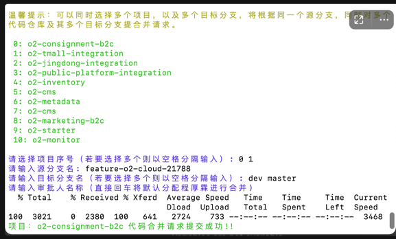

脚本使用教程：

1. 打开猪齿鱼gitlab https://code.choerodon.com.cn/
2. 再打开https://code.choerodon.com.cn/-/profile/personal_access_tokens页面，生成自己的ACCESS_TOKEN
   a. 填写Token name，随便填写合适的即可 
   b. 选择select scopes，勾选api权限
   c. 点击按钮，Create personal access token
3. 修改create-merge-request.sh文件，搜索下YOUR_ACCESS_TOKEN，先替换为自己的ACCESS_TOKEN。
4. 运行脚本 a. Mac用户： chmod +x create-merge-request.sh赋权限给该脚本后，直接运行即可 chmod +x create-merge-request.sh
   ./create-merge-request.sh b. Windows用户：解压压缩包后，进入文件夹后，用git bash打开后，./create-merge-request.sh脚本即可
   ./create-merge-request.sh
5. 如果需要启动调试模式，打印其中的参数，可添加参数y运行sh脚本 ./create-merge-request.sh y

运行效果如下图所示

声明：本脚本致力于为O2降本增效，解决了猪齿鱼gitlab界面需要重复操作多次的痛点问题，尤其适用于需要同时对多个代码仓库提合并请求的场景。 作者：zhanpeng.jiang

主要功能：可以同时选择多个项目，以及多个目标分支，将根据同一个源分支，同时对多个代码仓库及其多个目标分支提合并请求。

创造背景：入场OMS模块后，因为需要同时维护多个平台如天猫、京东、PUB平台、官网平台的代码，共四个平台，对应四个代码仓库。

然后每次在gitlab界面提交代码合并请求的时候，都需要操作很多次。

痛点问题：比如一个平台需要

- 打开gitlab界面（可能还得登录）
- 选源分支（接口查询时间）
- 选目标分支（接口查询时间）
- 进入页面加载转圈圈
- 选择审批人，还需要根据名称筛选匹配，或者鼠标滚轮滑下去（审批人接口响应时间）
- 再点击一个按钮，提交合并请求

试想一下，我们有四个平台，要将同一个源分支，分别合到dev、master分支，或者将来还有很多分支。 那么每个平台是8s，8（操作时间）*4（4个平台）*2（2个分支）= 64s